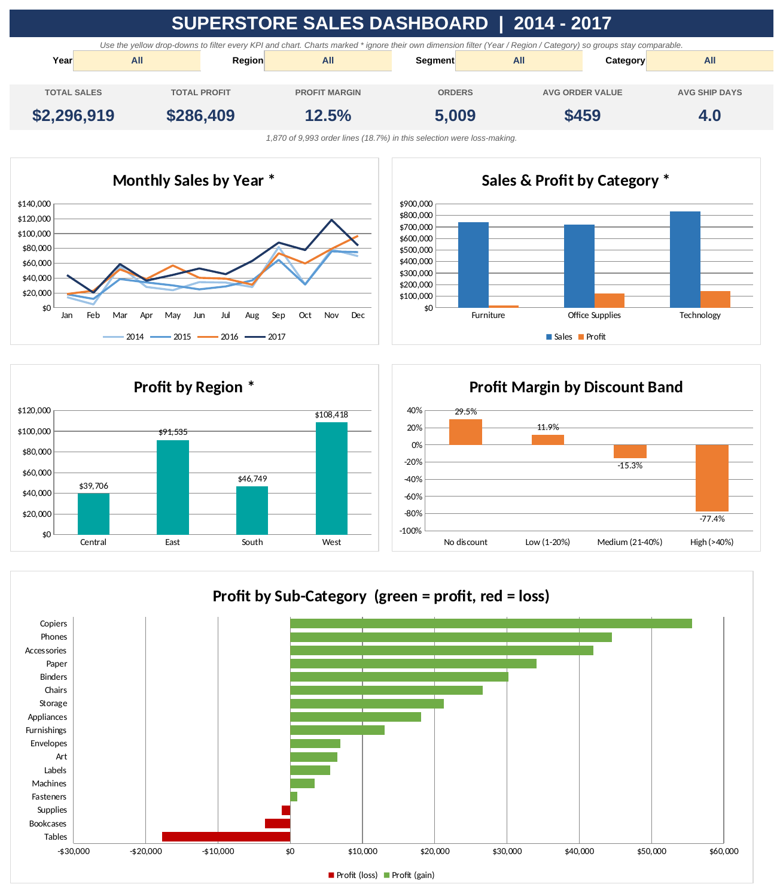
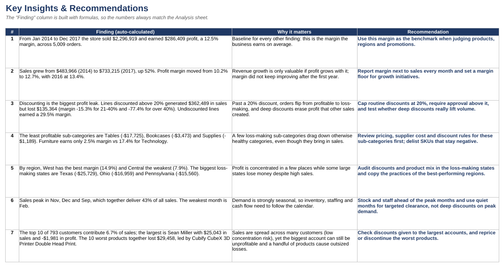
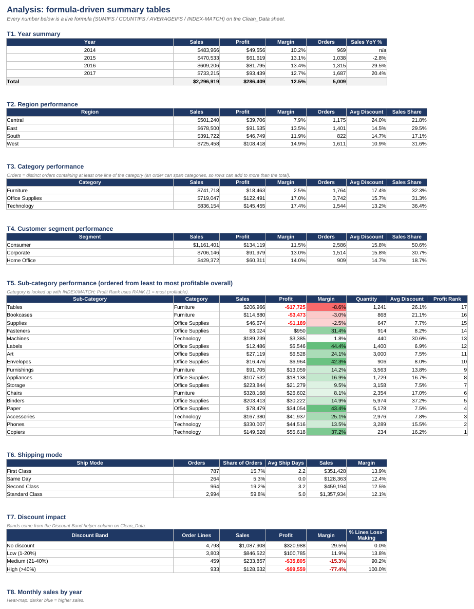
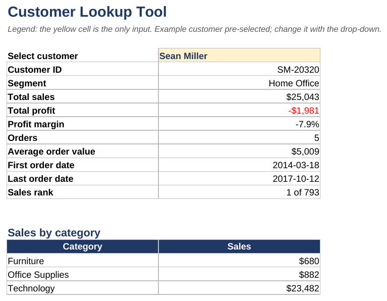
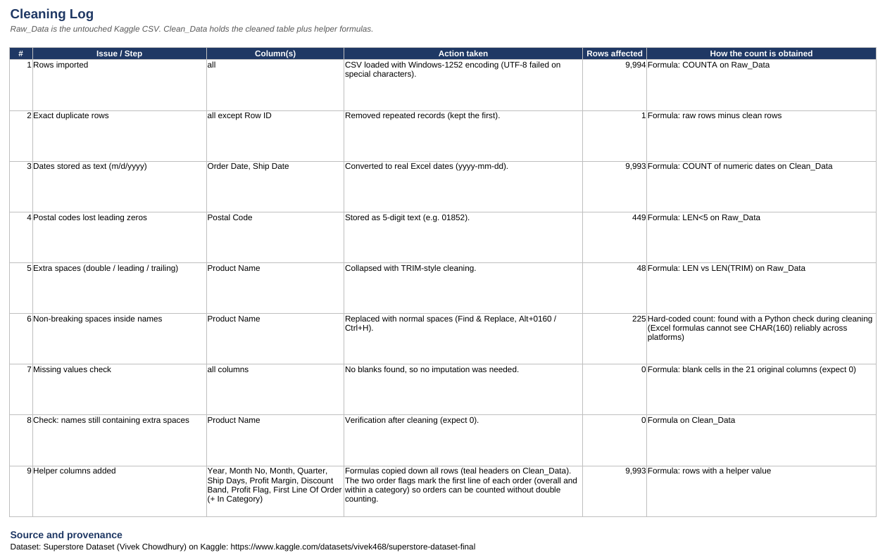

# Superstore Sales Analysis (Excel)

An end-to-end Excel analysis of four years of retail orders: cleaning, formula-driven analysis, an interactive dashboard, and business recommendations.



## Objective
Find out what drives sales and profit at a US retail superstore (2014-2017) and recommend actions that improve profitability.

## Dataset
- **Source:** [Superstore Dataset by Vivek Chowdhury (Kaggle)](https://www.kaggle.com/datasets/vivek468/superstore-dataset-final)
- **Size:** 9,994 rows x 21 columns (9,993 after cleaning), orders from Jan 2014 to Dec 2017
- **Fields:** order and ship dates, ship mode, customer and segment, location (city, state, region), product, category, sub-category, sales, quantity, discount, profit
- See [`data/README.md`](data/README.md) for provenance notes.

## Business questions
1. Which regions, categories and sub-categories drive sales and profit?
2. How do sales and profit trend over time and by season?
3. How do discounts affect profit?
4. Who are the top customers and products?
5. Which products and sub-categories lose money?

## Headline results

| Metric | Value |
|---|---|
| Total sales | $2,296,919 |
| Total profit | $286,409 |
| Profit margin | 12.5% |
| Orders | 5,009 |
| Customers | 793 |
| Order lines that lost money | 18.7% |

## Key insights

1. **Growth is strong, margin is flat.** Sales grew 52% from 2014 to 2017 ($483,966 to $733,215), but margin moved only from 10.2% to 12.7% and was highest in 2016 (13.4%).
2. **Discounting is the biggest profit leak.** Lines discounted above 20% brought in $362,489 in sales but lost $135,364 (margin -15.3% for 21-40% discounts, -77.4% above 40%). Undiscounted lines earned a 29.5% margin.
3. **Three sub-categories lose money:** Tables (-$17,725), Bookcases (-$3,473) and Supplies (-$1,189). As a result Furniture earns only a 2.5% margin versus 17.4% for Technology.
4. **Regions and states differ a lot.** West has the best margin (14.9%) and Central the weakest (7.9%). Texas (-$25,729), Ohio (-$16,959) and Pennsylvania (-$15,560) are the biggest loss-making states.
5. **Strong seasonality.** September, November and December deliver 43% of all sales; February is the weakest month.
6. **Customers are not concentrated, but one big account loses money.** The top 10 of 793 customers contribute 6.7% of sales. The largest customer (Sean Miller, $25,043 in sales) is unprofitable (-$1,981).
7. **A few products cause outsized losses.** The 10 least profitable products lost $29,458 together, led by the Cubify CubeX 3D Printer (double head).

## Recommendations
- Cap routine discounts at 20% and require approval above it; test whether deep discounts actually increase volume.
- Review pricing, supplier cost and discount rules for Tables, Bookcases and Supplies; delist items that stay negative.
- Audit discounting and product mix in Texas, Ohio and Pennsylvania.
- Stock and staff ahead of September, November and December; use quiet months for targeted clearance.
- Check the discounts given to the largest accounts and reprice or discontinue the worst-performing products.

## How the workbook is organised (`workbook/superstore_analysis.xlsx`)

| Sheet | Purpose |
|---|---|
| Cover | Objective, dataset, sheet guide, colour legend |
| Dashboard | KPI cards and 5 charts, filtered by Year / Region / Segment / Category drop-downs |
| Insights | Seven findings (numbers built with formulas), why they matter, recommendations |
| Analysis | 14 formula-driven tables (year, region, category, segment, sub-category, ship mode, discount bands, monthly heat-map, state ranking, top customers and products) |
| Customer_Lookup | Pick a customer to see sales, profit, orders, dates and rank |
| Cleaning_Log | Every cleaning step with row counts (mostly live formulas) |
| Clean_Data | Cleaned table plus helper-formula columns (teal headers) |
| Raw_Data | Untouched copy of the Kaggle CSV |
| Calc_Customers, Calc_Products, Dash_Calc | Helper sheets feeding the analysis and charts |

## Process

1. **Import and clean:** loaded the CSV with Windows-1252 encoding, converted text dates to real dates, stored postal codes as 5-digit text, removed one exact duplicate row, fixed non-breaking and extra spaces in product names, and checked for blanks (none). Full details in the `Cleaning_Log` sheet.
2. **Feature engineering (formulas):** Year, Month No, Month, Quarter, Ship Days, Profit Margin, Discount Band, Profit Flag, and two order-flag columns that count distinct orders without double counting.
3. **Analysis:** SUMIFS, COUNTIFS, AVERAGEIFS, MAXIFS/MINIFS, INDEX/MATCH, LARGE/SMALL and RANK on the cleaned data, with conditional-formatting heat-maps.
4. **Dashboard:** KPI cards and charts driven by drop-down filters; each KPI recalculates for the selected slice.
5. **Insights:** findings written as formulas so the text always matches the tables.

## Screenshots

| | |
|---|---|
|  |  |
|  |  |

## Skills demonstrated
Data cleaning, Excel formulas (SUMIFS, COUNTIFS, AVERAGEIFS, MAXIFS, INDEX/MATCH, RANK, TEXT), data validation drop-downs, conditional formatting, chart design, dashboard design, business storytelling.

## Limitations
- Superstore is a well-known sample dataset, so results illustrate the method rather than a real company.
- The data shows association, not proof of cause: for example, loss-making discount bands may partly reflect product mix.
- The dataset has no cost or returns detail, so profit is used as given.

## How to use
1. Download `workbook/superstore_analysis.xlsx` and open it in Excel (desktop recommended; formulas use MAXIFS/MINIFS from Excel 2019 or Microsoft 365).
2. Go to the **Dashboard** sheet and change the yellow drop-downs.
3. Read **Insights** for the conclusions and **Analysis** for the supporting tables.

## Files
```
project-1-superstore-sales/
├── README.md
├── data/            Sample_Superstore.csv (+ provenance notes)
├── workbook/        superstore_analysis.xlsx
└── images/          dashboard and sheet screenshots
```
