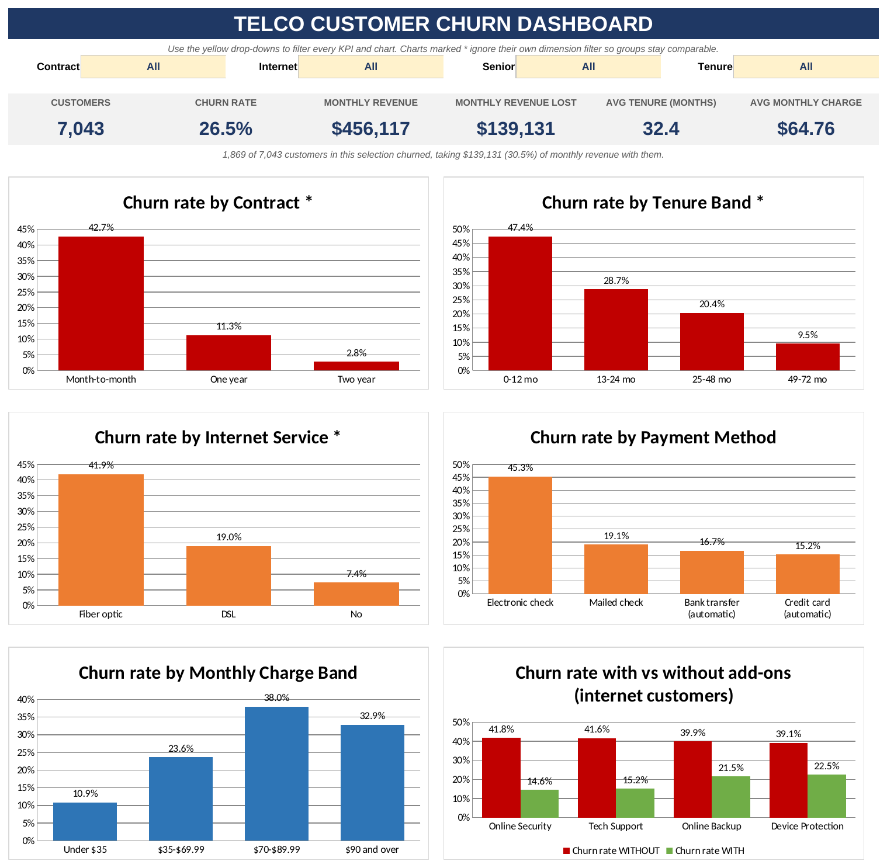
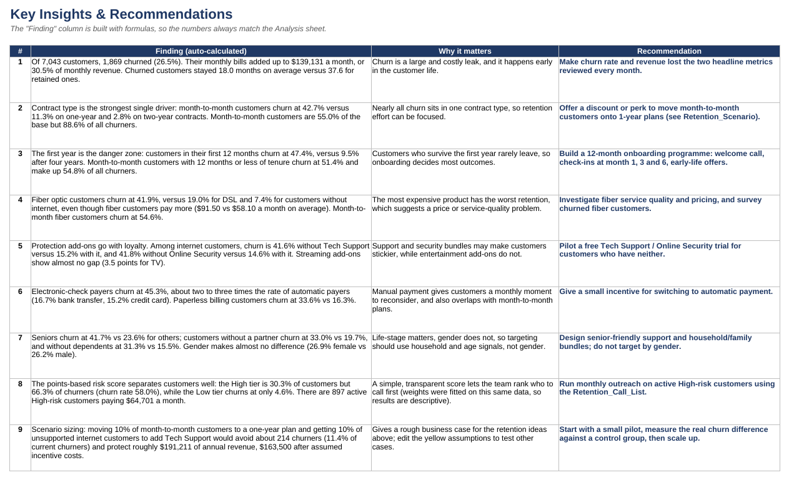
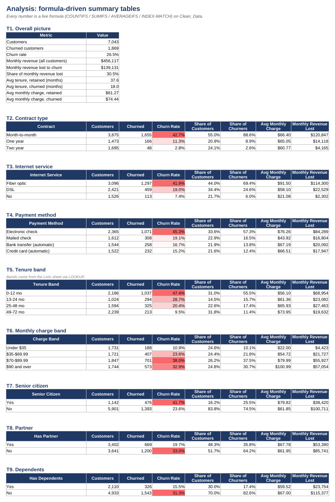
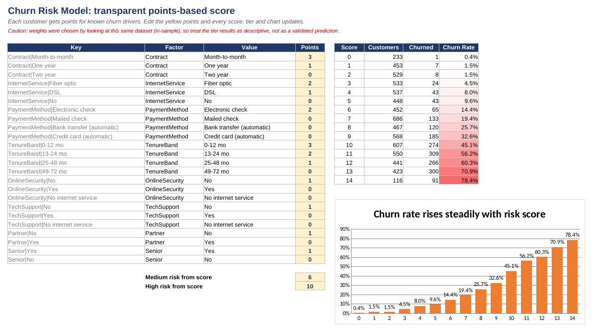
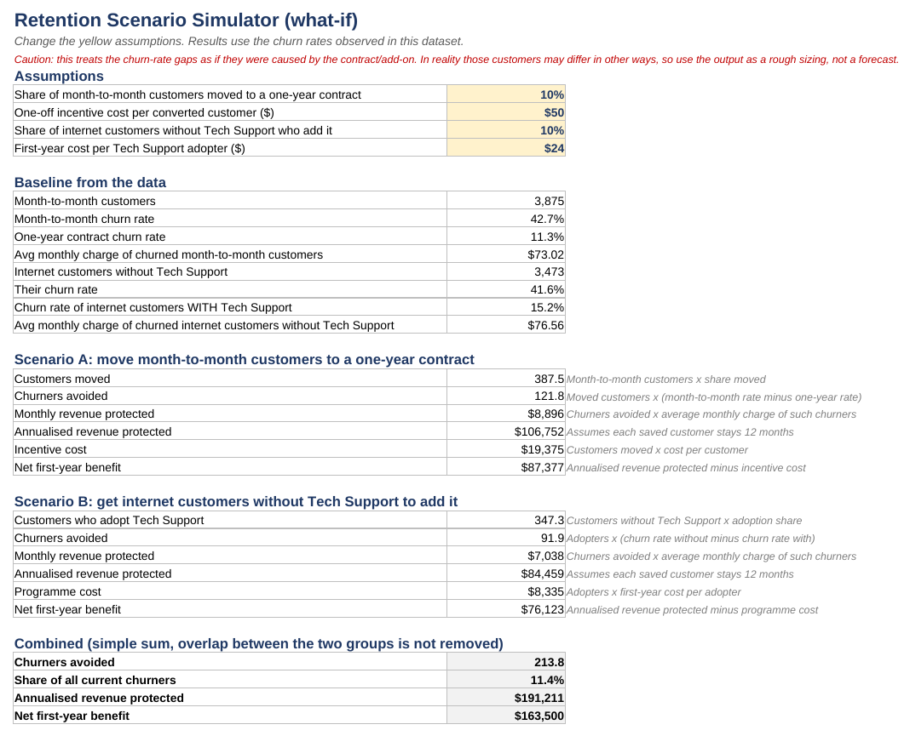
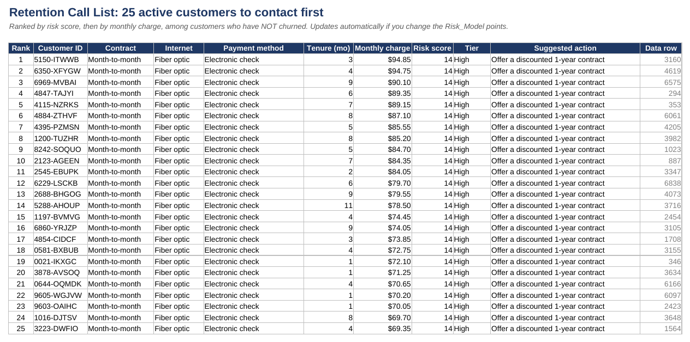
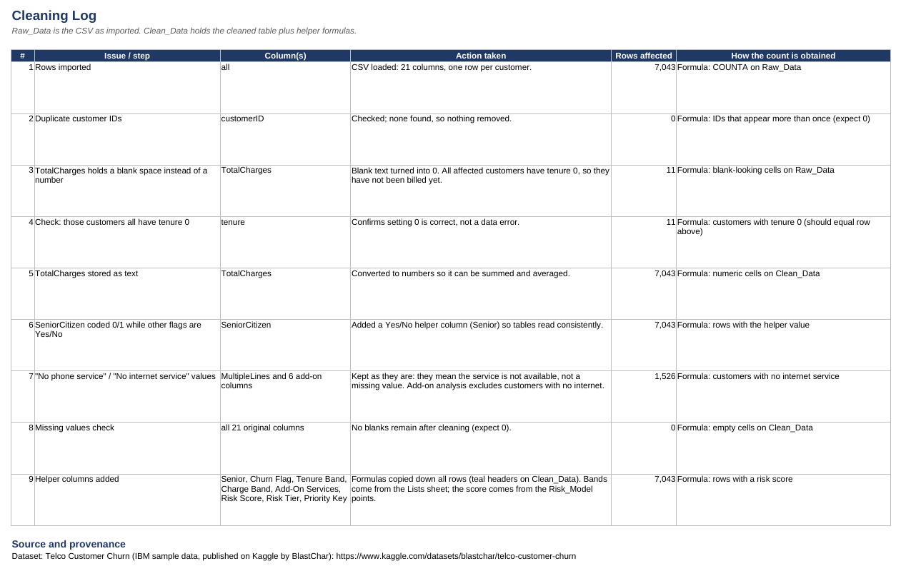

# Telco Customer Churn Analysis (Excel)

An end-to-end Excel analysis of why telecom customers leave: cleaning, formula-driven analysis, an interactive dashboard, a points-based risk score, a what-if retention simulator and a ranked call list.



## Objective
Find out who churns and why, size the revenue at risk, and recommend retention actions a telecom company could test.

## Dataset
- **Source:** [Telco Customer Churn (IBM sample data, on Kaggle by BlastChar)](https://www.kaggle.com/datasets/blastchar/telco-customer-churn)
- **Size:** 7,043 customers x 21 columns (one row per customer)
- **Fields:** demographics, phone and internet services, add-ons, contract, billing method, tenure, monthly and total charges, and whether the customer churned
- See [`data/README.md`](data/README.md) for provenance notes.

## Business questions
1. How much churn is there, and what does it cost in revenue?
2. Which customer segments and services churn the most?
3. Can customers be ranked by churn risk with a simple, explainable score?
4. What could retention actions be worth?

## Headline results

| Metric | Value |
|---|---|
| Customers | 7,043 |
| Churned | 1,869 (26.5%) |
| Monthly revenue | $456,117 |
| Monthly revenue lost to churn | $139,131 (30.5%) |
| Avg tenure: churned vs retained | 18.0 vs 37.6 months |

## Key insights

1. **Contract type is the strongest driver.** Month-to-month customers churn at 42.7%, versus 11.3% on one-year and 2.8% on two-year contracts. They are 55.0% of customers but 88.6% of all churners.
2. **The first year is the danger zone.** Customers with 12 months or less of tenure churn at 47.4%, versus 9.5% for those with 49-72 months. Month-to-month customers in their first year churn at 51.4% and make up 54.8% of all churners.
3. **Fiber optic has the worst retention** (41.9% vs 19.0% for DSL and 7.4% for no internet) even though fiber customers pay more ($91.50 vs $58.10 per month). Month-to-month fiber customers churn at 54.6%.
4. **Protection add-ons go with loyalty.** Among internet customers, churn is 41.6% without Tech Support vs 15.2% with it, and 41.8% without Online Security vs 14.6% with it. Streaming add-ons show a much smaller gap.
5. **Payment method matters.** Electronic-check payers churn at 45.3%, versus 15.2-19.1% for the other three methods.
6. **Life stage matters, gender does not.** Seniors churn at 41.7% (vs 23.6%), customers without a partner at 33.0% (vs 19.7%), and without dependents at 31.3% (vs 15.5%). Female and male customers churn at 26.9% and 26.2%.
7. **A simple risk score works well descriptively.** The High-risk tier is 30.3% of customers but captures 66.3% of churners (58.0% churn rate), while the Low tier churns at 4.6%. 897 active High-risk customers pay $64,701 a month.
8. **Rough business case.** Moving 10% of month-to-month customers to one-year plans and getting 10% of unsupported internet customers to add Tech Support would avoid about 214 churners (11.4% of current churners) and protect roughly $191,000 of annual revenue ($163,500 after assumed incentive costs).

## Recommendations
- Offer a discount or perk to move month-to-month customers onto 1-year plans.
- Build a 12-month onboarding programme (welcome call, check-ins at months 1, 3 and 6).
- Investigate fiber service quality and pricing; survey churned fiber customers.
- Pilot a free Tech Support / Online Security trial for customers who have neither.
- Give a small incentive for switching to automatic payment.
- Run monthly outreach on active High-risk customers using the Retention_Call_List.
- Start with a small pilot and a control group to measure the real effect before scaling.

## How the workbook is organised (`workbook/telco_churn_analysis.xlsx`)

| Sheet | Purpose |
|---|---|
| Cover | Objective, dataset, sheet guide, colour legend |
| Dashboard | 6 KPI cards and 6 charts, filtered by Contract / Internet / Senior / Tenure drop-downs |
| Insights | Nine findings (numbers built with formulas), why they matter, recommendations |
| Analysis | 15 formula-driven tables, including churn heat-maps and risk tiers |
| Risk_Model | Editable points table that scores every customer; chart of churn rate by score |
| Retention_Scenario | What-if simulator driven by yellow assumption cells |
| Retention_Call_List | 25 active customers to contact first, ranked by risk and monthly charge |
| Cleaning_Log | Every cleaning step with row counts (live formulas) |
| Clean_Data / Raw_Data | Cleaned table plus helper-formula columns / the CSV as imported |
| Lists, Dash_Calc | Band definitions and chart feeds |

## Process
1. **Clean:** converted TotalCharges from text to numbers; 11 blank values belonged to customers with tenure 0 (not yet billed) and were set to 0; checked duplicate IDs (none) and empty cells (none); added a Yes/No helper for SeniorCitizen. See the `Cleaning_Log` sheet.
2. **Helper columns (formulas):** Senior, Churn Flag, Tenure Band and Charge Band (LOOKUP on editable band tables), Add-On Services count, Risk Score, Risk Tier, and a priority key for the call list.
3. **Analyse:** COUNTIFS, SUMIFS, AVERAGEIFS, INDEX/MATCH, LARGE and RANK, plus conditional-formatting heat-maps.
4. **Score:** a transparent points table (contract, internet type, payment method, tenure, support and security add-ons, partner, senior) turns drivers into a score from 0 to 14, grouped into Low / Medium / High tiers.
5. **Simulate:** the scenario sheet converts churn-rate gaps into customers, monthly revenue and annual value protected, minus assumed costs.
6. **Dashboard and insights:** drop-down filters recalculate every KPI and chart; insight text is built with formulas so it always matches the tables.

## Screenshots

| | |
|---|---|
|  |  |
|  |  |
|  |  |

## Skills demonstrated
Data cleaning, Excel formulas (COUNTIFS, SUMIFS, AVERAGEIFS, LOOKUP, INDEX/MATCH, LARGE, RANK, TEXT), rule-based scoring, what-if modelling, data validation drop-downs, conditional formatting, chart and dashboard design, business storytelling.

## Limitations
- The data is a well-known sample dataset, so findings illustrate the method rather than a real company.
- The data shows association, not proof of cause. For example, customers on one-year contracts may differ from month-to-month customers in other ways, so the scenario results are rough sizing, not forecasts.
- The risk-score weights were chosen by looking at this same dataset (in-sample), so the tier results are descriptive. A real model would be tested on held-out data.
- The dataset is a single snapshot: it has no dates, so seasonality and churn timing cannot be analysed.

## How to use
1. Download `workbook/telco_churn_analysis.xlsx` and open it in desktop Excel.
2. On **Dashboard**, change the yellow drop-downs.
3. On **Risk_Model** and **Retention_Scenario**, change the yellow cells to see tiers and business cases update.
4. Read **Insights** for conclusions and **Analysis** for the supporting tables.

## Files
```
project-2-telco-churn/
├── README.md
├── data/        WA_Fn-UseC_-Telco-Customer-Churn.csv (+ provenance notes)
├── workbook/    telco_churn_analysis.xlsx
└── images/      dashboard and sheet screenshots
```
