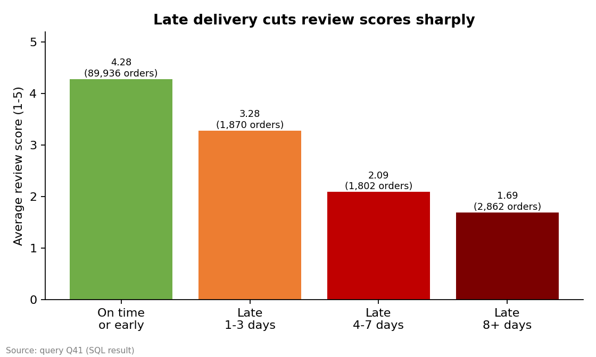
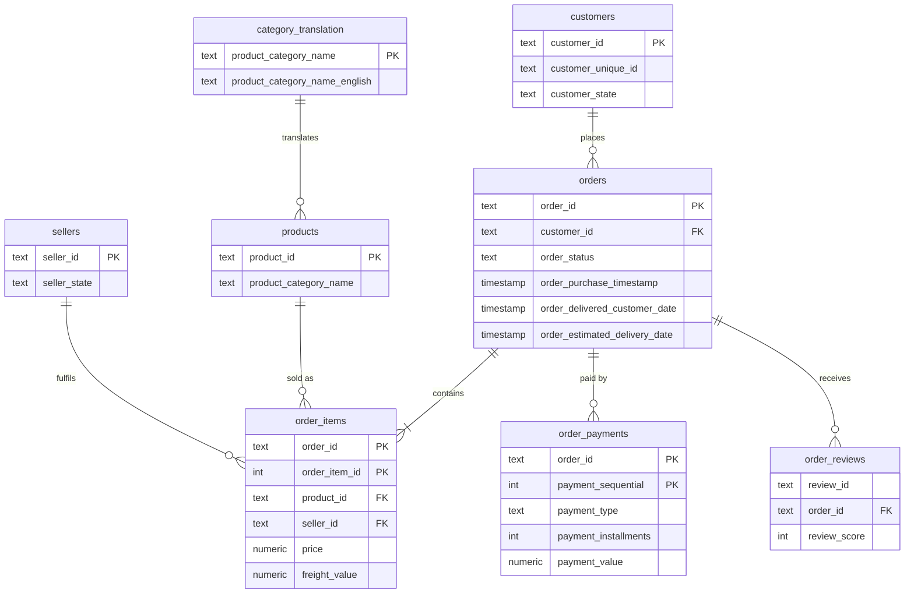
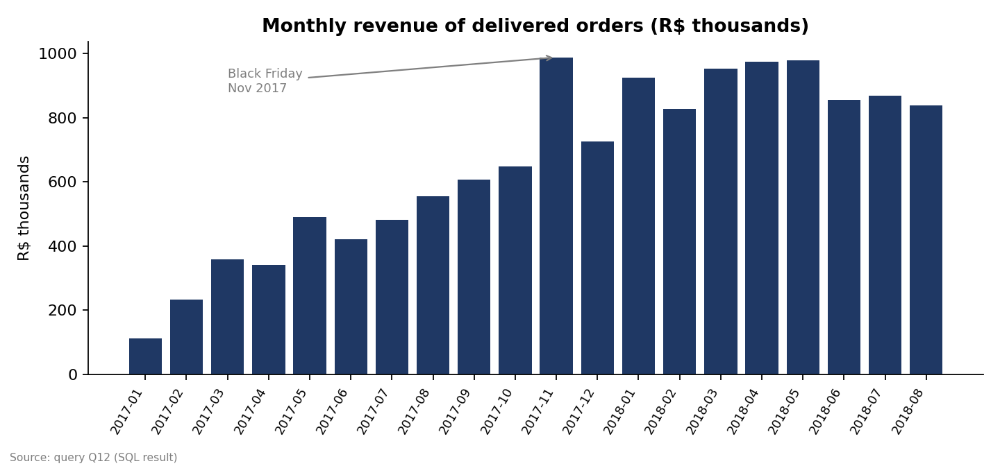
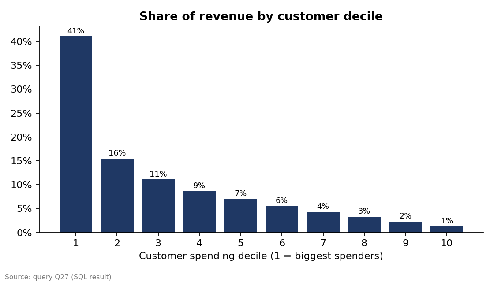
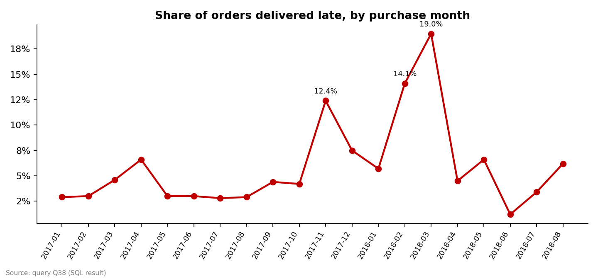

# Olist E-Commerce Analysis (PostgreSQL)

A SQL analysis of about 100,000 orders from a Brazilian online marketplace. I built the database from raw CSV files, checked data quality, and wrote 44 queries that answer business questions about sales, customers, sellers, delivery and customer satisfaction.



## Objective
Understand how the marketplace performs and find what hurts customer satisfaction, using only SQL for the analysis. (Charts in this README were drawn from the saved query results.)

## Dataset
- **Source:** [Brazilian E-Commerce Public Dataset by Olist (Kaggle)](https://www.kaggle.com/datasets/olistbr/brazilian-ecommerce)
- **Period:** orders from Sep 2016 to Oct 2018 (almost all from Jan 2017 to Aug 2018)
- **Size:** 8 related tables, about 100k orders, 112k order items, 3k sellers, 33k products
- The CSVs are not stored in this repo. See [`data/README.md`](data/README.md) for download steps and a provenance note.

## Database design



Primary and foreign keys are enforced in `sql/01_schema.sql`, so the load itself confirms there are no orphan rows. Two source quirks are handled on purpose: `customer_id` changes with every order (the real person is `customer_unique_id`), and `review_id` is not unique, so reviews have no primary key.

## Business rules used everywhere
- **Revenue** = sum of item `price` for **delivered** orders (freight excluded).
- **Customer** = `customer_unique_id`, not `customer_id`.
- **Late order** = delivered on a later calendar day than the estimated delivery date.
- **Reviews:** one review per order (the latest), through the `v_order_review` view.

## Project structure

```
project-1-olist-ecommerce/
├── README.md
├── run_all.sh                    rebuild everything from scratch
├── run_queries.py                runs every numbered query and saves results/*.csv
├── sql/
│   ├── 01_schema.sql             tables, keys, indexes
│   ├── 02_load_data.sql          \copy loads for the 8 CSVs
│   ├── 03_data_quality_checks.sql   Q01-Q10
│   ├── 04_views.sql              reusable views + a materialized view
│   ├── 05_sales_analysis.sql        Q11-Q22
│   ├── 06_customer_analysis.sql     Q23-Q28
│   ├── 07_seller_product_analysis.sql   Q29-Q36
│   ├── 08_delivery_satisfaction.sql     Q37-Q44
│   └── 09_performance_tuning.sql    index vs no index (EXPLAIN ANALYZE)
├── results/                      one CSV per query
├── images/                       charts drawn from the results
└── data/                         put the Kaggle CSVs here (not committed)
```

## Key findings

### Sales
1. **The marketplace grew fast, then levelled off.** Delivered-order revenue rose from R$112K in Jan 2017 to a Black Friday peak of **R$988K in Nov 2017** (+52.4% on the month, then -26.5% in December). Through 2018 it stayed between about R$0.83M and R$0.98M a month. Year-over-year growth for Jan-Aug fell from +727% in January to **+51% in August** (Q13-Q15).
2. **Headline numbers:** 96,478 delivered orders, 93,358 customers, **R$13.2M revenue**, average order value R$137. Order values are very skewed: median R$105, mean R$160, the top 1% above R$1,052 (Q11, Q22).
3. **Revenue is spread across categories but concentrated geographically.** The top 3 categories (health_beauty, watches_gifts, bed_bath_table) bring in 25.9% and the top 10 bring in 62.4% of revenue. **São Paulo state alone is 38.3% of revenue**, and 59.6% of sellers are in SP, which produce 64.4% of revenue (Q16, Q17, Q31).
4. **Credit cards dominate:** 78.5% of paid value (boleto 18.0%). A third of card payments are paid in full; 15.4% use 7-10 installments and those are the biggest tickets (average R$331 vs R$96 for single payments) (Q18, Q19).
5. **Orders cluster on weekday afternoons and evenings:** Monday is the busiest day (16.3% of orders), Saturday the quietest (10.9%), and afternoon plus evening make up 72.8% of orders (Q20, Q21).



### Customers
6. **Almost nobody comes back.** 97.0% of customers placed exactly one order; only 2.8% ordered twice and 0.24% three or more times. For the 2017 cohorts, just **0.52% bought again in the following month** and about 0.25% in each of months 3-6 (Q23, Q25, Q26).
7. **Revenue relies on the top spenders.** The top 10% of customers by spend generate **41.1% of revenue**; the bottom half generate 16.7% (Q27).
8. **RFM segments:** repeat buyers (active or cooling off) are only 3.0% of customers and 5.5% of revenue, while one-time buyers who spent a lot but have not returned ("Lapsed big spenders") are 22.2% of customers and 42.0% of revenue, the largest re-engagement pool (Q24).
9. **Repeat rates are low everywhere** (1.7% to 3.3% across states with 1,000+ customers), so the problem is not regional (Q28).



### Sellers and products
10. **Seller revenue is fairly spread:** 533 of 2,970 active sellers (17.9%) generate 80% of revenue, and the biggest seller holds only 1.7% (Q29, Q30).
11. **Cheap items carry heavy shipping.** For items under R$50, freight equals 47% of the price (versus 5% above R$500). Items under R$50 are 34.7% of units but only 9.1% of revenue. Freight is highest relative to price in electronics (29.5%), office_furniture (25.0%) and furniture_decor (23.7%) (Q33, Q34).
12. **Customers like some categories much more than others.** Average review is highest for luggage_accessories (4.36) and lowest for **office_furniture (3.64, with 22.2% negative reviews)**, followed by bed_bath_table (3.98) (Q35).
13. **Most orders are single-item** (90.0%), but 4+ item baskets are worth about three times as much (R$387 vs R$130) (Q36).

### Delivery and satisfaction
14. **Late delivery is the biggest driver of bad reviews in this data.** Orders delivered on time average **4.28 stars (9.5% negative)**. Arriving 1-3 days late drops that to 3.28 (32.4% negative), 4-7 days late to 2.09 (68.1%), and 8+ days late to **1.69 (79.5% negative)** (Q41).
15. **Speed matters even when on time:** among on-time orders the average review falls from 4.41 (under a week) to 3.91 (three weeks or more) (Q42).
16. **Overall delivery is good but breaks at peak times.** Average delivery takes 12.6 days (median 10.2, p90 23.1) and orders arrive on average 11.9 days before the estimate, with only 6.8% late. But lateness spiked to **12.4% for Nov 2017 orders, 14.1% in Feb 2018 and 19.0% in Mar 2018** (Q37, Q38).
17. **The north-east is slowest.** Customers in CE wait 21.3 days on average (13.8% late) and BA 19.3 days (12.2% late), versus 8.8 days (4.5% late) in SP (Q39).
18. **A few sellers are repeat offenders:** the worst seller with 100+ orders is late on 19.0% of them, nearly 3 times the platform rate of 6.8% (Q44).



## Recommendations
- **Protect delivery promises at peak times:** add carrier capacity and set more realistic estimates for Black Friday and the Feb-Mar period, since lateness is what turns satisfied customers into 1-2 star reviewers.
- **Monitor seller delivery performance monthly** and warn or support sellers whose late rate is far above the platform average (Q44 lists the first ten).
- **Improve logistics to the north-east** (CE, BA, PE) with regional fulfilment or carrier changes.
- **Build a repeat-purchase programme:** with only about 3% of customers ordering twice, a modest lift (second-order coupon, post-delivery email) is worth more than acquiring new customers. Target high-spending one-time buyers first.
- **Reduce the shipping burden on low-priced items** (free-shipping thresholds, bundling, multi-item discounts).
- **Review office_furniture and bed_bath_table** (bulky items, low reviews, high freight) for packaging and delivery problems.
- **Reduce dependence on São Paulo** by recruiting sellers in other states.

## SQL skills demonstrated

| Skill | Examples |
|---|---|
| Schema design, constraints, indexes | `01_schema.sql` (PK, FK, CHECK, composite keys, 7 indexes) |
| Bulk loading | `02_load_data.sql` (`\copy`, `FORCE_NULL`) |
| Data quality checks | Q01-Q10: orphans, nulls, duplicates, impossible dates, reconciliation |
| Joins (inner, left, anti-join with NOT EXISTS) | Q05, Q07, Q16, Q29, Q41 |
| Aggregation, GROUP BY / HAVING, FILTER | Q02, Q15, Q28, Q34 |
| CTEs (including chained CTEs) | Q13, Q24, Q25, Q29, Q44 |
| Window functions: LAG, running totals, moving average | Q13, Q14 |
| Window functions: RANK, DENSE_RANK, ROW_NUMBER, NTILE, FIRST_VALUE | Q24, Q27, Q30, Q32, Q39 |
| Percentiles (`PERCENTILE_CONT`) | Q22, Q37 |
| CASE bucketing and conditional logic | Q19, Q21, Q33, Q41 |
| Cohort and retention analysis | Q25, Q26 |
| RFM customer segmentation | Q24 |
| Pareto / cumulative share analysis | Q16, Q30 |
| Views and a materialized view | `04_views.sql` |
| Avoiding join fan-out (aggregate before joining) | `v_order_summary`, Q10, Q18 |
| Query plans and indexing | `09_performance_tuning.sql` |

### Two techniques worth highlighting

**1. Avoiding the join fan-out trap.** Orders have several items and several payments. Joining all three tables directly would multiply rows and inflate revenue, so `v_order_summary` aggregates items and payments separately first:

```sql
WITH items AS (SELECT order_id, SUM(price) AS items_value FROM order_items GROUP BY order_id),
     pay   AS (SELECT order_id, SUM(payment_value) AS paid_value FROM order_payments GROUP BY order_id)
SELECT o.order_id, i.items_value, p.paid_value
FROM orders o
LEFT JOIN items i USING (order_id)
LEFT JOIN pay   p USING (order_id);
```

**2. Measuring the impact of late delivery (Q41).** Bucket orders by how late they were, join the latest review, and compare:

```sql
SELECT CASE WHEN s.days_vs_estimate <= 0 THEN '1 On time or early'
            WHEN s.days_vs_estimate <= 3 THEN '2 Late by 1-3 days'
            WHEN s.days_vs_estimate <= 7 THEN '3 Late by 4-7 days'
            ELSE '4 Late by 8+ days' END                   AS delivery_outcome,
       COUNT(*)                                            AS orders,
       ROUND(AVG(r.review_score), 2)                       AS avg_review_score,
       ROUND(100.0 * AVG((r.review_score <= 2)::int), 1)   AS pct_negative_reviews
FROM v_order_summary s
JOIN v_order_review r USING (order_id)
WHERE s.order_status = 'delivered' AND s.days_vs_estimate IS NOT NULL
GROUP BY 1
ORDER BY 1;
```

## How to run it yourself

You need PostgreSQL 12 or newer (tested on 16), `psql`, and Python 3 (only for saving results to CSV).

1. Download the 8 CSV files from Kaggle into `data/` (see [`data/README.md`](data/README.md)).
2. Open a terminal **in the project root** (the `\copy` paths are relative to it).
3. Run everything:
   ```bash
   ./run_all.sh            # macOS / Linux / Git Bash
   ```
   or step by step:
   ```bash
   createdb olist
   psql -d olist -f sql/01_schema.sql
   psql -d olist -f sql/02_load_data.sql
   psql -d olist -f sql/04_views.sql
   psql -d olist -f sql/05_sales_analysis.sql      # and 06, 07, 08, 03, 09
   python run_queries.py olist                     # saves every result to results/
   ```
4. Prefer a GUI? Open the `.sql` files in pgAdmin or DBeaver and run them in order, then run the `\copy` lines from `psql`.

If you use MySQL or SQL Server instead, some syntax needs changes (`FILTER`, `DISTINCT ON`, `PERCENTILE_CONT ... WITHIN GROUP`, `::` casts, `DATE_TRUNC`, `TO_CHAR`).

## Limitations
- **Data version:** the reviews file used here has 100,000 rows, versus 99,224 in Kaggle's current release, so review-based numbers may shift slightly with the official file (see `data/README.md`).
- **Cut-off effects:** 2016 is nearly empty and the data stops in Aug-Sep 2018, so growth and "lapsed customer" measures depend on the observation window.
- **Association, not cause:** late delivery and low reviews move together, but other factors (product quality, seller behaviour) are not controlled for.
- **Estimated delivery date** is set by the marketplace, so "late" depends on how conservative the estimate is; deliveries arrive 11.9 days early on average.
- **Category labels:** 610 products have no category and 13 have no English translation; they appear as `unknown` or in Portuguese.
- **Anonymised, sample-like data:** findings illustrate the method and are not a view of the real company today.
- The geolocation table is not used.
